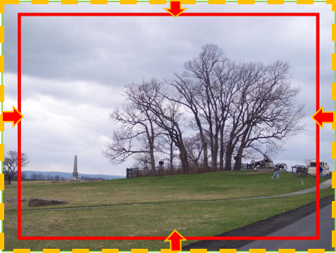
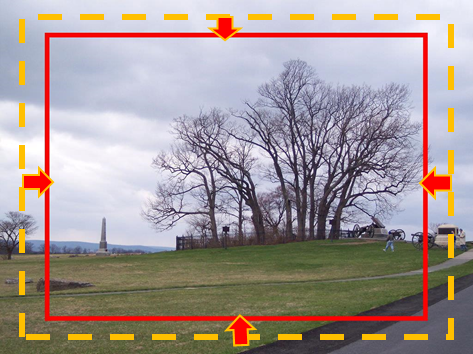
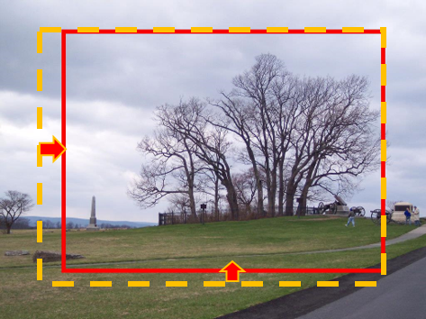
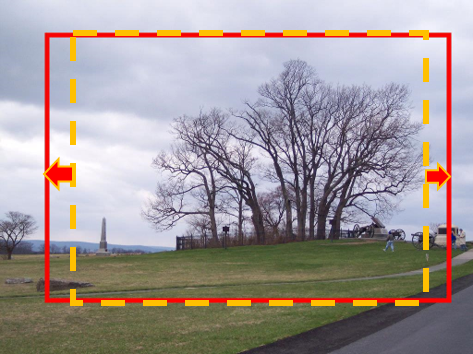
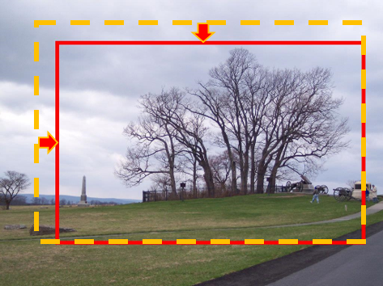
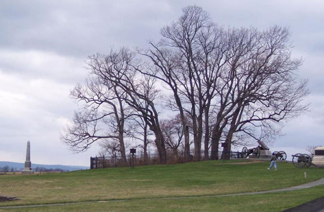
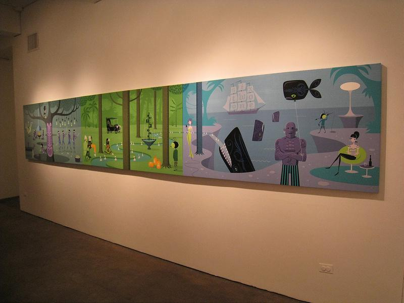
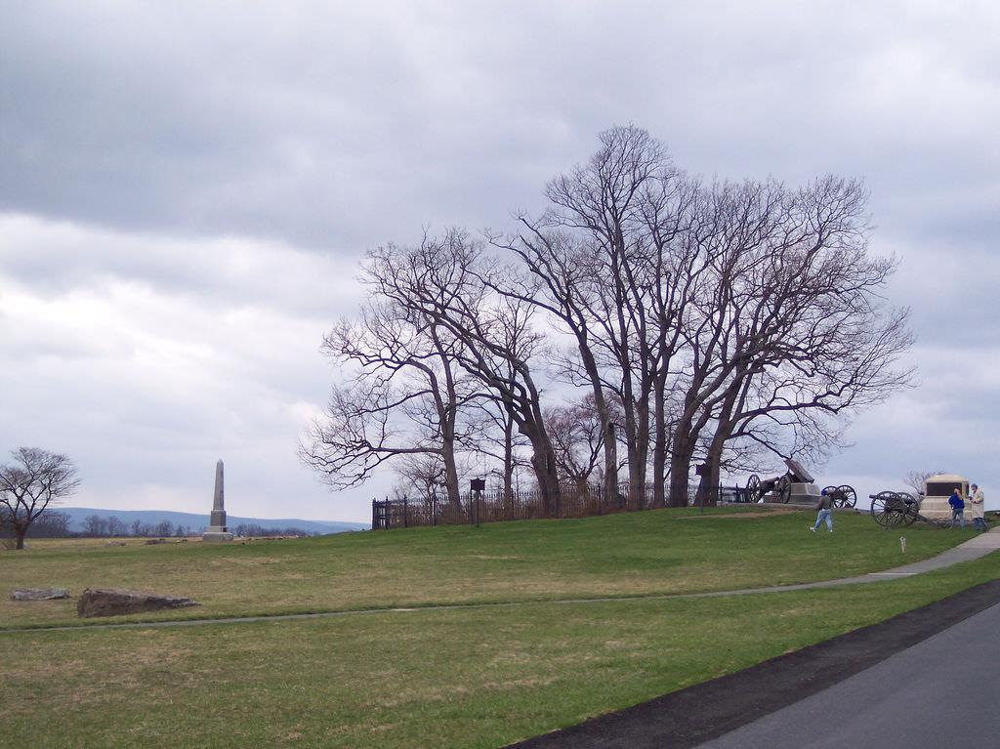
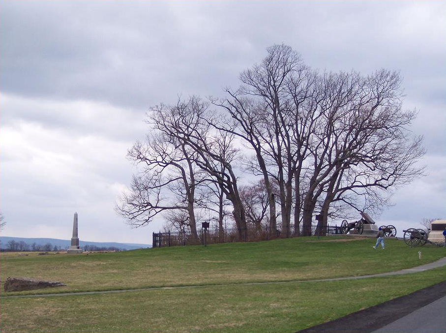
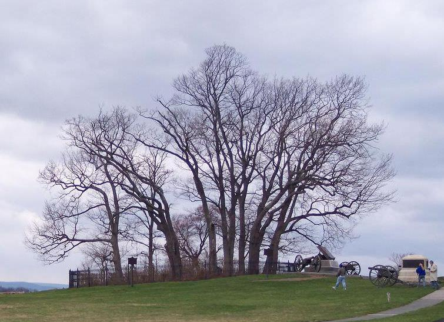

# TF-A2RL
[[Project]](https://debangli.github.io/A2RL/)   [[Paper]](https://arxiv.org/abs/1703.07195)  
The official implementation for A2-RL: Aesthetics Aware Rinforcement Learning for Automatic Image Cropping

Download model [here](https://drive.google.com/open?id=0Bybnpq8dvwudREJnRWhFbk1rYW8)

example scripts: example.sh

## Overview

| source | step 1 | step 2 | step 3 | step 4 | step 5 | output| 
| --- | --- | --- | --- | --- | --- | --- |
|  |  |  |  |  |  |  |

A2-RL (aka. Aesthetics Aware Reinforcement Learning) is the author's implementation of the RL-based automatic image cropping algorithm described in:  
"A2-RL: Aesthetics Aware Reinforcement Learning for Automatic Image Cropping"   
Debang Li, Huikai Wu, Junge Zhang, Kaiqi Huang

Given a source image, our algorithm could take actions step by step to find almost the best cropping window on source image. 

Contact: Hui-Kai Wu (huikaiwu@icloud.com)

## Getting started
* Install the TensorFlow
* Download the code from GitHub:
```bash
git clone https://github.com/wuhuikai/TF-A2RL.git
cd TF-A2RL
```
* Download the pretrained models `vfn_rl.pk` from [Google Drive](https://drive.google.com/open?id=0Bybnpq8dvwudREJnRWhFbk1rYW8), then put them in current directory (`TF-A2RL/`).

* Run the python script:
``` bash
python A2RL.py --image_path test_images/3846.jpg --save_path test_images/3846_cropped.jpg
```
or
``` bash
sh example.sh
```

## Results compared with baseline methods

|Source| VFN+Sliding window | A2-RL | Ground Truth |
| --- | --- | --- |---|
|  |  |  |  |
|  |  |  |  |
|  |  |  |  |
|  |  |  |  |
|  |  |  |  |

## Requirements
The code requires the following 3rd party libraries:
* pickle
* numpy
* [skimage](http://scikit-image.org/)
```bash
pip install scikit-image
```
Details see the official [README](https://github.com/scikit-image/scikit-image) for installing skimage.
* [TensorFlow](https://www.tensorflow.org/)
Details see the official [README](https://github.com/tensorflow/tensorflow) for installing TensorFlow. 
## Command line arguments:
Type `python A2RL.py --help` for a complete list of the arguments.
* `--image_path`: path of the input image
* `--save_path`: path of output image
## Citation
```
@article{wu2017gp,
  title={A2-RL: Aesthetics Aware Reinforcement Learning for Automatic Image Cropping},
  author={Debang Li, Wu, Huikai and Zheng, Shuai and Zhang, Junge and Huang, Kaiqi},
  year={2017}
}
```